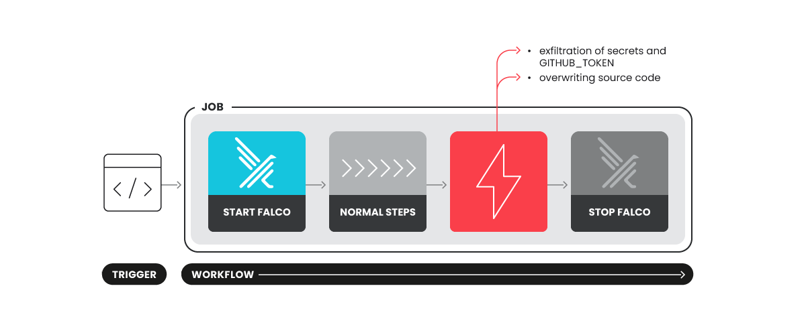
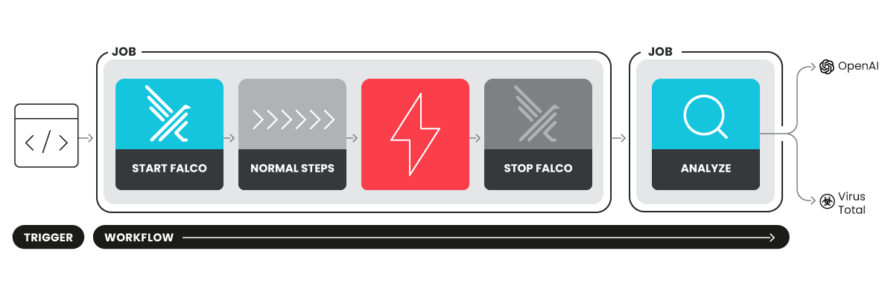

# Falco Actions

[](https://github.com/falcosecurity/evolution/blob/main/REPOSITORIES.md#ecosystem-scope) [](https://github.com/falcosecurity/evolution/blob/main/REPOSITORIES.md#sandbox)

[](https://github.com/falcosecurity/falco-actions/releases/latest)

Run [Falco](https://github.com/falcosecurity/falco) in GitHub Actions to detect suspicious behavior in your CI/CD workflows. 

These GitHub Actions can be used to monitor your GitHub runner and detect Software Supply Chain attacks thanks to ad-hoc Falco rules specific to this use case.

The repository is home of three GitHub Actions, namely `start`, `stop` and `analyze`. We currently support two modes of operation:

- live mode
- analyze mode

Let's delve into their details.

> Note: we recommend users to always pin the dependencies of these GitHub Actions to ensure the use of an immutable release


## Live mode

Live mode is meant to protect a single job at runtime. To use this mode, only the `start` and `stop` actions are required. 



The `start` action will be responsible of starting `Falco` in a Docker container using its `modern_ebpf` probe. 
In turn, the `stop` action will stop the container, and a summary of triggered Falco rules will be printed in the job summary. 

> Note: The `actions: read` permission is used to contact a Github endpoint to perform a best-effort correlation of Falco events to the job's step. In this way, users can better understand where the problem occurred and try to remediate faster.

### Example

```yaml
jobs:
  foo:
    runs-on: ubuntu-latest
    permissions:
      contents: read
      actions: read
    steps:
    - name: Start Falco
      uses: falcosecurity/falco-actions/start@<commit-sha>
      with:
        mode: live
        falco-version: '0.39.0'
        verbose: true
        
    # ...
    # Your steps here
    # ...

    - name: Stop Falco
      uses: falcosecurity/falco-actions/stop@<commit-sha>
      with:
        mode: live
        verbose: true
```

### Start action

Start action accept the following inputs: 

| Input            | Description                                      | Type    | Required | Default                     |
|------------------|--------------------------------------------------|---------|----------|-----------------------------|
| `mode`           | Start action with a mode. Can be live or analyze | choice  | false    | live                      |
| `falco-version`  | Falco version to use                             | string  | false    | latest                      |
| `config-file`    | Start action with a config file (analyze mode only) | string  | false    | src/syscall_ignore.config   |
| `custom-rule-file` | Custom rule file                               | string  | false    | (empty)                     |
| `verbose`        | Enable verbose logs                              | boolean | false    | false                       |


#### Config file - syscall filtering
Captures can become very big and complex to manage. To address this, applying syscall filters helps keep captures manageable while retaining all the necessary information to assess activity in our workflows. 

By default, the action will drop the following syscalls specified in the `syscall_ignore.config` file.

```yaml
{
    "ignore_syscalls": [
        "switch",
        "rt_sigprocmask",
        "clock_gettime",
        "rt_sigaction",
        "waitid",
        "getpid",
        "clock_getres",
        "mprotect",
        "gettimeofday",
        "close",
        "time",
        "getdents64",
        "clock_nanosleep"
    ]
}
```
By passing a custom file to the action, it's possible to override the syscall filtered by default and apply custom filters.

> Note: currently only syscall filters are supported on the capture level. More specific filters can be applied using Falco conditions in the analyze action.

### Stop action

Stop action accept the following inputs: 

| Input            | Description                                      | Type    | Required | Default                     |
|------------------|--------------------------------------------------|---------|----------|-----------------------------|
| `mode`           | Start action with a mode. Can be live or analyze | choice  | false    | live                      |
| `verbose`        | Enable verbose logs                              | boolean | false    | false                       |

## Analyze mode

Analyze mode is meant to offer a more detailed report. 



To achieve this, a `scap` file is generated via a [Sysdig OS](https://github.com/draios/sysdig) container, which is started and stopped using the `start` and `stop` actions, respectively. The capture file is then uploaded as an artifact and passed to a subsequent `analyze` job, that uses the `analyze` action. The latter may use additional secrets we want to keep separate from the job we are protecting and integrate with external services to provide more relevant security information, such as OpenAI, VirusTotal, and more. 
The final report will (configurably) contain:
- Falco rules triggered during steps' execution. 
- Contacted IPs
- Contacted DNS domains
- SHA256 hash of spawned executables
- Spawned container images
- Written files
- A summary of the report generated with OpenAI
- Reputation of Contacted IPs
- Reputation of SHA256 hashes


### Example

```yaml
jobs:
  foo:
    runs-on: ubuntu-latest
    permissions:
      contents: read
      actions: read
    steps:
    - name: Start Falco
      uses: falcosecurity/falco-actions/start@<commit-sha>
      with:
        mode: analyze
        
    # ...
    # Your steps here
    # ...

    - name: Stop Falco
      uses: falcosecurity/falco-actions/stop@<commit-sha>
      with:
        mode: analyze
  
  analyze-foo:
    runs-on: ubuntu-latest
    permissions:
      contents: read
      actions: read
    steps:
    - name: Analyze
      uses: falcosecurity/falco-actions/analyze@<commit-sha>
      with:
        falco-version: '0.39.0'
```
### Analyze Action

Analyze action currently accepts the following config inputs:

| Input                 | Description                                | Type    | Required | Default             |
|-----------------------|--------------------------------------------|---------|----------|---------------------|
| `custom-rule-file`    | Custom rule file                           | string  | false    | (empty)             |
| `falco-version`       | Falco version to use                       | string  | false    | latest              |
| `filters-config`      | Filter configuration file                  | string  | false    | src/filters.config  |

#### Config file - filtering and exceptions
Filters and exceptions can be applied to the report to create tailored insights, reduce false positives, and highlight critical information. Since Falco runs under the hood, you can easily leverage Falco conditions to add exceptions and filters.

We currently accept filters on:
- outbound_connections
- written_files
- processes

By default, this action applies exceptions specified in the `filters.config` file. You can override default filters by providing a custom file to the action.

#### Example

```yaml

{
  "outbound_connections": [
    {
      "description": "Filter for connection from pythonist ",
      "condition": "proc.name in (pythonist, dragent)"
    }
  ],
  "written_files": [
    {
      "description": "Filter for file writes to github runner",
      "condition": "fd.name startswith '/home/runner/runners/' and proc.exepath endswith '/bin/Runner.Worker' and proc.pexepath endswith '/bin/Runner.Listener'"
    }
  ],
  "processes": [
    {
      "description": "Whitelisting noisy process names.",
      "condition": "proc.name in (sysdig, systemd-logind, systemd-network, systemd-resolve, systemd-udevd, linux-bench, journalctl, systemd-journal, systemd-cgroups)"
    }
  ]
}
```

### Report Customization
The report produced by analyze action can be customized using the following inputs:

| Input                 | Description              | Type    | Required | Default |
|------------------------|--------------------------|---------|---------|----------|
| `extract-connections`  | Extract connections      | boolean | false    | true    |
| `extract-processes`    | Extract processes        | boolean | false    | true    |
| `extract-dns`          | Extract DNS              | boolean | false    | true    |
| `extract-containers`   | Extract containers       | boolean | false    | true    |
| `extract-written-files`| Extract written files    | boolean | false   | false    |
| `extract-chisels`      | Extract chisels          | boolean | false   | false    |
| `extract-hashes`       | Extract hashes           | boolean | false   | false    |


### External Dependencies 
Analyze mode currently supports two main external dependencies:
- OpenAI - Using OpenAI you can generate an understanble summary report and customise it on your needs.
- VirusTotal - Using VirusTotal you can get the reputation of IPs and Hashes found during the run

Analyze action currently accepts the following inputs for external dependencies:

| Input                 | Description              | Type    | Required |  Default |
|------------------------|--------------------------|---------|---------|----------|
| `openai-model`        | OpenAI model to use for summary            | string  | false    | gpt-3.5-turbo       |
| `openai-user-prompt`  | Message to send to OpenAI                  | string  | false    | (empty)             |

#### Example
```yaml
    steps:
    - name: Analyze
      uses: falcosecurity/falco-actions/analyze@<commit-sha>
      with:
        falco-version: '0.39.0'
        openai-user-prompt: "Pls add remediation steps"
        openai-model: "gpt-3.5-turbo"
      env:
        GITHUB_TOKEN: ${{ secrets.GITHUB_TOKEN }}
        OPENAI_API_KEY: ${{ secrets.OPENAI_API_KEY }}
        VT_API_KEY: ${{ secrets.VT_API_KEY }}
```

## Join the Community

To get involved with The Falco Project, please visit [the community repository](https://github.com/falcosecurity/community) to find out more.

How to reach out?

 - Join the [#falco](https://kubernetes.slack.com/messages/falco) channel on the [Kubernetes Slack](https://slack.k8s.io)
 - [Join the Falco mailing list](https://lists.cncf.io/g/cncf-falco-dev)

## Reporting security vulnerabilities

Please report security vulnerabilities following the community process documented [here](https://github.com/falcosecurity/.github/blob/master/SECURITY.md).

## License Terms

This project is licensed to you under the [Apache 2.0](./LICENSE) open source license.


